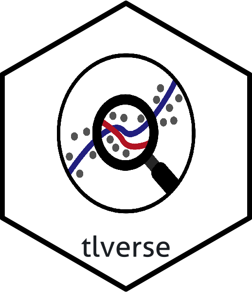

<!-- README.md is generated from README.Rmd. Please edit that file -->

# R/`tlverse` 

> An Umbrella Package for Targeted Learning in the `tlverse`

**Author:** [Jeremy Coyle](https:://github.com/jeremyrcoyle)

-----

## What’s `tlverse`?

`tlverse` is an umbrella package for targeted learning in R.

`library(tlverse)` loads the following core packages:

  - [sl3](https://sl3.tlverse.org) for Super Learning
  - [tmle3](https://tmle3.tlverse.org) for TMLE (Targeted Minimum
    Loss-based Estimation)

as well as the following helper packages:

  - [origami](https://origami.tlverse.org) for cross-validation
  - [delayed](https://delayed.tlverse.org) for parallelizing dependent
    tasks

and packages for individual `tmle3` parameters:

*coming soon…*

-----

## Installation

Some of these packages are not yet on CRAN, so for now the only option
is to install directly via github using devtools:

``` r
devtools::install_github("tlverse/tlverse")
```
